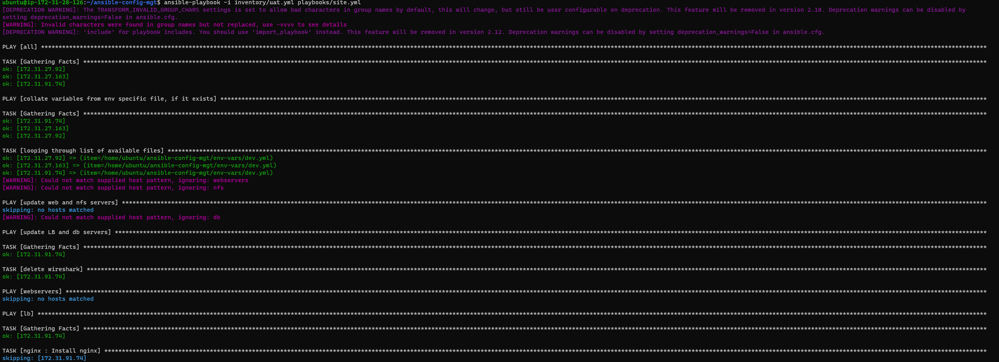

# Ansible Dynamic Assignments (Include) and Community Roles

## In this project we will introduce Ansible dynamic assignments by using include module

This project builds on the previous Project 12. In https://github.com/amarhussona/ansible-config-mgt GitHub repository start a new branch and call it `dynamic-assignments`. In this project, I used vscode to implement git and configuration to see if I would prefer it moving forward:


Create a new folder, name it `dynamic-assignments`. Then inside this folder, create a new file and name it `env-vars.yml`. Instruct `site.yml` to include this playbook later:


Since the same Ansible will be used to configure multiple environments, and each of these environments will have certain unique attributes, such as servername, ip-address etc., there needs to be a way to set values to variables per specific environment.

For this reason, create a folder to keep each environment’s variables file. Therefore, create a new folder env-vars, then for each environment, create new YAML files which will be used to set variables:


Now update the env-vars.yml file:


## Update site.yml with dynamic assignments

Update `site.yml` file to make use of the dynamic assignment. `site.yml` should now look like this:


On Jenkins-Ansible server make sure that git is installed with git --version, then go to ‘ansible-config-mgt’ directory and run:
```
git init
git pull https://github.com/<your-name>/ansible-config-mgt.git
git remote add origin https://github.com/<your-name>/ansible-config-mgt.git
git branch roles-feature
git switch roles-feature
```


Download Mysql Ansible Role. With Ansible Galaxy again, we can simply download a ready to use ansible role, and keep going. We will be using a MySQL role developed by geerlingguy. https://galaxy.ansible.com/geerlingguy/mysql

Inside roles directory create new MySQL role with ansible-galaxy install geerlingguy.mysql and rename the folder to mysql


Read README.md file, and edit roles configuration to use correct credentials for MySQL required for the tooling website.


Now it is time to upload the changes into your GitHub:


## Load Balancer roles

We want to be able to choose which Load Balancer to use, Nginx or Apache, so we need to have two roles respectively:

Nginx and Apache

Since you cannot use both Nginx and Apache load balancer, you need to add a condition to enable either one – this is where you can make use of variables.

Use an Ansible utility called ansible-galaxy inside ansible-config-mgt/roles directory (you need to create roles directory upfront)


Declare a variable in defaults/main.yml file inside the nginx and apache roles. Name each variables enable_nginx_lb and enable_apache_lb respectively.

Set both values to false like this enable_nginx_lb: false and enable_apache_lb: false.

Declare another variable in both roles load_balancer_is_required and set its value to false as well:


Update both static-assignments directory file (loadbalancers.yml) and site.yml files respectively

With when condition It was used to decide the nature of load balancer installed in an environment depending on which variables is set to true see the code snippet below:


Now you can make use of env-vars\uat.yml file to define which loadbalancer to use in UAT environment by setting respective environmental variable to true.

You will activate load balancer, and enable nginx by setting these in the respective environment’s env-vars file:


The same must work with apache LB, so you can switch it by setting respective environmental variable to true and other to false:




As shown in the image above, the playbook worked up until the Task `apache: start apache httpd` due to the ip provided being the nginx loadbalancer. This works and when provided apache ip is configured instead, the task is complated.

Project done.